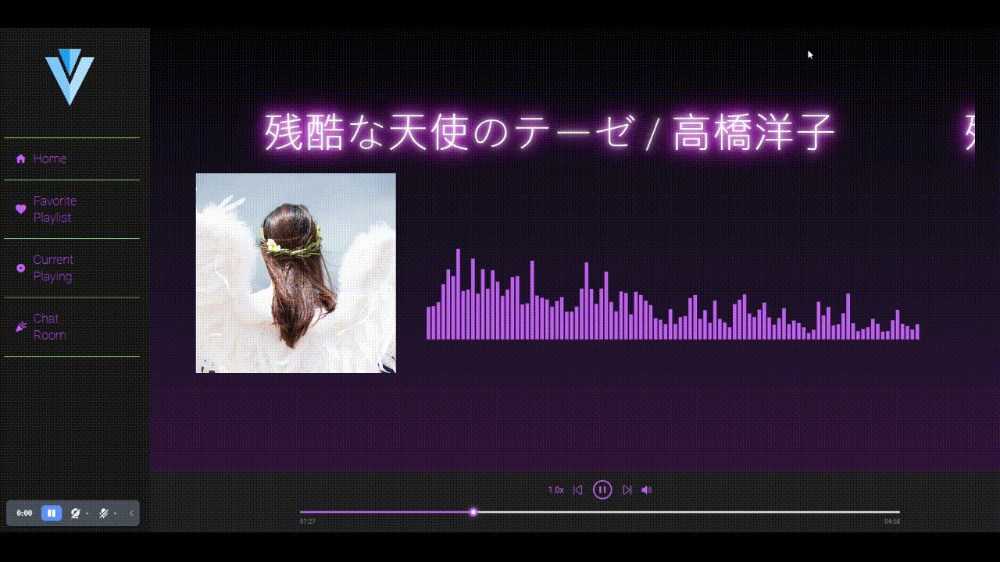
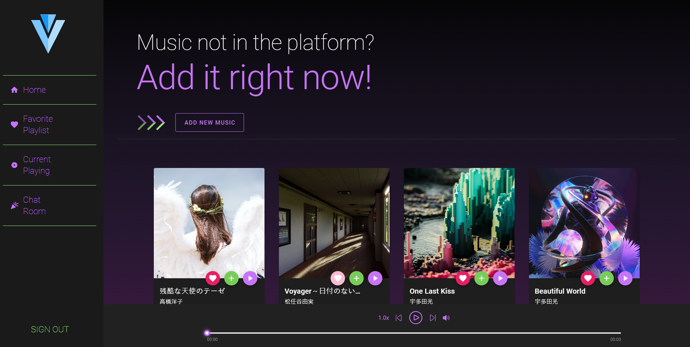
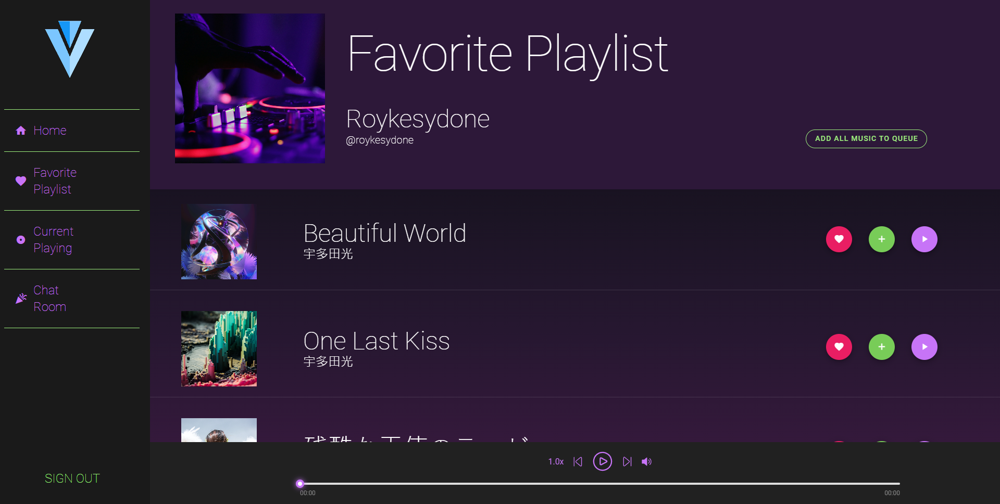
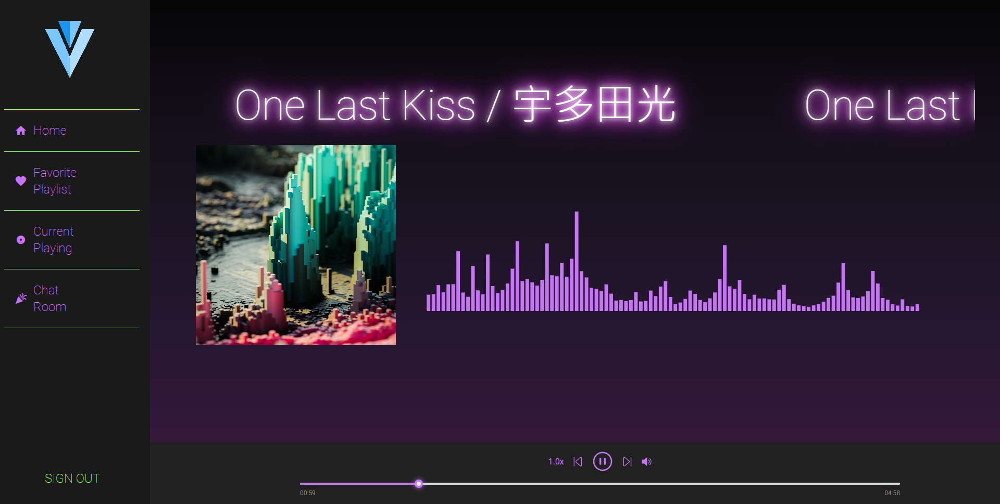
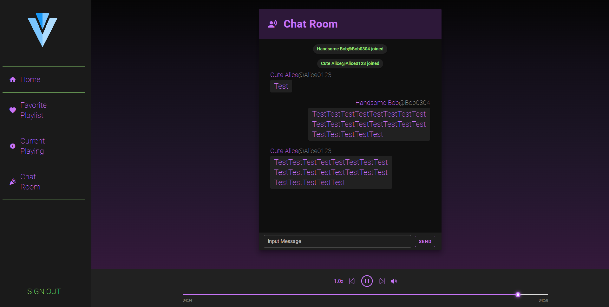

# Roykestereo
A cloud music platform with chat room function

- Implementation method
  - Chat room
    - sokcet.io
  - Audio visualization
    1. 傅立葉
    2. 取 0 ~ 2000 Hz
    3. 取 log
    2. 歸一化
    



## demo
### Home


### Favorite Playlist


### Current Playing


### Chat Room

## How To Execute(develope)
- database
  1. write .env

  2.  ```bat
      docker-compose up
      ```
  - port
    - mongo-express
      - 8085
    - mongodb
      - 27119

- backend
  1. write .env

  2.  ```
      cd ./backend
      ```

  2.  ```
      pipenv install 
      ```

  3.  ```
      pipenv run python app.py
      ```

  - port 
    - 5000

- frontend
  1. wrtie ./frontend/src/config.js

  2.  ```
      cd ./frontend
      ```

  2.  ```
      npm install
      ```

  2.  ```
      npm run serve
      ```

  - port 
    - 8080


## TODO / Problem

- Chat room authentication
  - get session / JWT
- Production process
- Duplicated code
  - Frontend reqeust
  - Backend authentication(decorator)
- Split to components

## Bugs that need to be fixed

- If click music player's Next/PrevMusic button quickly, It might get the wrong wave file
  - Might relate to the asynchronous request in the watch part

## Source of high quality picture in project

unsplash.com
